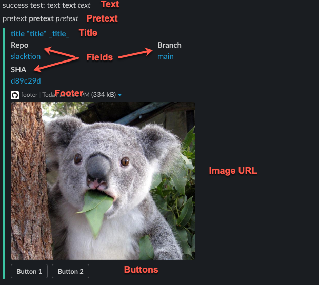

# Slacktion

Yet another Slack action that sends a Slack message. This supports buttons, links, and other fun things. It was intended to make the transition from Bitrise to Actions easier by keeping same configuration. Inspired by [bitrise-steplib/steps-slack-message](https://github.com/bitrise-steplib/steps-slack-message) ([License](https://github.com/bitrise-steplib/steps-slack-message/blob/ce2f9f8776e1520a1d229cea8b25efe33fb1417a/LICENSE)).

---

## **Inputs**

### **`slack_bot_token`**

**Required** Sends a Slack message and support buttons, links, and other fun things. Intended to make transition from Bitrise to Actions easier by keeping same configuration

### **`channel`**

**Required** Sends a Slack message and support buttons, links, and other fun things. Intended to make transition from Bitrise to Actions easier by keeping same configuration

### **`job_status`**

**Required** Sends a Slack message and support buttons, links, and other fun things. Intended to make transition from Bitrise to Actions easier by keeping same configuration

### **`text`**

**Optional** Sends a Slack message and support buttons, links, and other fun things. Intended to make transition from Bitrise to Actions easier by keeping same configuration

### **`pretext`**

**Optional** Sends a Slack message and support buttons, links, and other fun things. Intended to make transition from Bitrise to Actions easier by keeping same configuration

### **`title`**

**Optional** Sends a Slack message and support buttons, links, and other fun things. Intended to make transition from Bitrise to Actions easier by keeping same configuration

### **`title_url`**

**Optional** Sends a Slack message and support buttons, links, and other fun things. Intended to make transition from Bitrise to Actions easier by keeping same configuration

### **`image_url`**

**Optional** Sends a Slack message and support buttons, links, and other fun things. Intended to make transition from Bitrise to Actions easier by keeping same configuration

### **`footer`**

**Optional** Sends a Slack message and support buttons, links, and other fun things. Intended to make transition from Bitrise to Actions easier by keeping same configuration

### **`footer_icon_url`**

**Optional** Sends a Slack message and support buttons, links, and other fun things. Intended to make transition from Bitrise to Actions easier by keeping same configuration

### **`fields`**

**Optional** Sends a Slack message and support buttons, links, and other fun things. Intended to make transition from Bitrise to Actions easier by keeping same configuration

### **`buttons`**

**Optional** Sends a Slack message and support buttons, links, and other fun things. Intended to make transition from Bitrise to Actions easier by keeping same configuration

## Usage

The following example shows all options configured

```yml
# shorten ref and sha to avoid wrapping
- run: |
    echo "SHORT_REF=${GITHUB_REF#refs/heads/}" >> $GITHUB_ENV
    echo "SHORT_SHA=${GITHUB_SHA:0:7}" >> $GITHUB_ENV
    echo "SHORT_REPO=${GITHUB_REPOSITORY/*\//}" >> $GITHUB_ENV
- uses: actions/checkout@v2
# action requires node
- uses: actions/setup-node@v1
  with:
    node-version: "12.x"
- name: All fields configured
  uses: nick-fields/slacktion@v1
  with:
    # only token authentication is supported
    slack_bot_token: ${{ secrets.SLACK_BOT_TOKEN }}
    # the channel to post to
    channel: ${{ secrets.SLACK_CHANNEL }}
    # status of the job from context
    job_status: ${{ job.status }}
    # each of the following are optional
    text: "${{ job.status }} test: text *text* _text_"
    pretext: pretext *pretext* _pretext_
    title: title *title* _title_
    title_url: https://google.com
    image_url: https://live.staticflickr.com/65535/26338881111_635425673d_b.jpg
    footer: footer
    footer_icon_url: https://github.githubassets.com/images/modules/logos_page/GitHub-Mark.png
    # note that the default $GITHUB_* env vars aren't used and instead those values are pulled from context
    # this is probably a bug in the action, or in my multiline yaml, but until it's fixed just use context
    fields: |
      Repo|<https://github.com/${{ github.repository }}~~${{ ${{ env.SHORT_REPO }} }}>
      Branch|<https://github.com/${{ github.repository }}/tree/${{ github.ref }}~~${{ env.SHORT_REF }}>
      SHA|<https://github.com/${{ github.repository }}/tree/${{ github.sha }}~~${{ env.SHORT_SHA }}>
    buttons: |
      Button 1|https://google.com
      Button 2|https://bing.com
```

Here's the result of the above configuration



